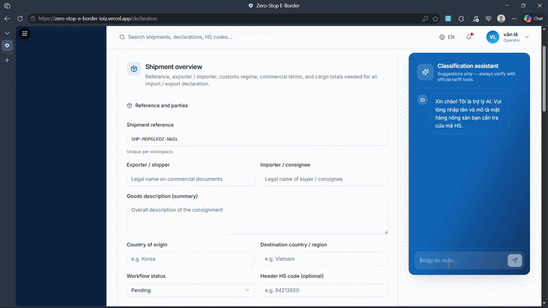
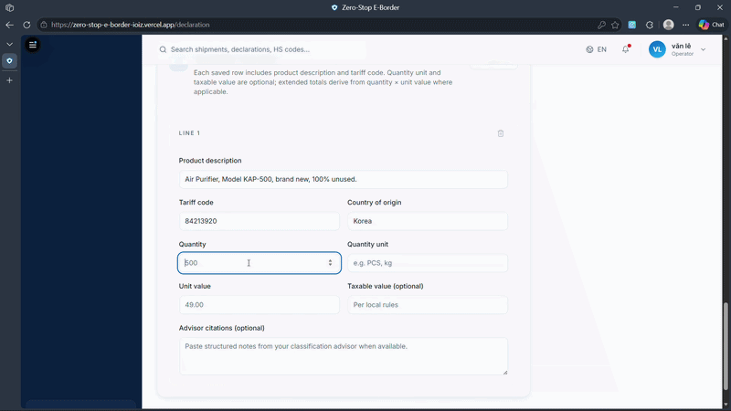

# Borderflow AI

**Zero-Stop E-Border** — a web platform for smart customs workflows: digitized declarations, document uploads, AI-assisted HS classification assistance, structured document extraction and verification, shipment tracking, risk visualization, gate simulation, and admin tooling.

The front end is a **Vite**, **React 18**, and **TypeScript** single-page application, styled with **Tailwind CSS** and **shadcn/ui**, with **TanStack Query**, **React Router**, and **Recharts**. Persistence and authentication are integrated with **Supabase** (PostgreSQL schema in `supabase/migrations/schema.sql`). Document intelligence is handled by an optional Python **FastAPI** service under `ai-service/`.

---

## Live demo

- **Application:** [zero-stop-e-border-ioiz.vercel.app](https://zero-stop-e-border-ioiz.vercel.app)

Demo accounts:

| Role | Email | Password |
|------|------|----------|
| Customs | `haiquan@gmail.com` | `123456789` |
| Business | `legiavan0210@gmail.com` | `123456` |
| Admin | `admin@gmail.com` | `123456` |

---

## Highlights

### AI HS-Advisor (Smart Declaration)

An assistant suggests HS-oriented guidance via an external automation workflow ([n8n](https://n8n.io)): the UI posts chat messages to a configured webhook (see `src/pages/Declaration.tsx`). Workflow export for reference: `HS_Code_Recommender.json` (agent + retrieval over a vector database).

<p align="center">
  
</p>

<p align="center">
  
</p>

### AI Auditor Agent (verification pipeline)

Uploaded PDFs (invoices, packing lists, etc.) are processed by **`ai-service`**: text extraction from PDFs, structured field inference via **OpenAI** chat models, normalization, and deterministic comparison against the saved declaration to populate verification status and mismatch fields in Supabase.

<p align="center">
  
</p>

### Vision Edge Gate (simulation)

A **UI simulation** of ANPR-style checks and container identification with PASS/HOLD outcomes. Not wired to an on-device vision model in this repository.

<p align="center">
  
</p>

---

## Feature overview

| Area | Description |
|------|--------------|
| **Dashboard** | Shipment KPIs, risk share, timelines |
| **Declaration** | Shipment capture, PDF attachments, HS assistant chat |
| **Verification** | Extracted fields, declaration-vs-document comparison, re-scan orchestration via API |
| **Tracking** | Map-oriented route and event timeline |
| **Risk analysis** | Score and narrative-style UI (risk rules for stored scores are separate from HS webhook) |
| **Border gate** | Simulated scans vs declaration |
| **Admin** | Profiles, audit-style logs, AI settings placeholders |

---

## Architecture & technology stack

```
Browser (React) ──► Supabase (auth, Postgres, Storage)
       │
       ├──► Webhook URL (HS assistant / n8n)
       │
       └──► ai-service FastAPI ──► OpenAI ──► updates documents.* via Supabase service role
```

| Layer | Technologies |
|--------|----------------|
| **Web** | React 18, TypeScript, Vite, TanStack Query, React Router, Recharts |
| **UI** | Radix primitives, Tailwind CSS, shadcn/ui patterns |
| **Backend (data)** | Supabase (PostgreSQL + Auth + Storage) |
| **Document AI** | Python 3, FastAPI, OpenAI API, pdfplumber, Pydantic |
| **Automation (HS)** | n8n workflow (export in repo); stack in export includes retrieval (e.g. Qdrant) and hosted LLMs per your deployment |

---

## Repository layout

| Path | Purpose |
|------|---------|
| `src/pages/` | Feature routes: Dashboard, Declaration, Verification, Tracking, Risk, Gate, Admin |
| `src/components/` | Shared layout, widgets, charts |
| `src/lib/` | Supabase helpers, AI pipeline client (`declarationAiPipeline.ts`) |
| `ai-service/` | FastAPI — `/api/verify`, `/api/declaration/process-documents`, health route |
| `supabase/migrations/` | PostgreSQL schema, indexes, policies |
| `HS_Code_Recommender.json` | Exported n8n workflow for HS assistant (credentials not included) |

---

## Prerequisites

- **Node.js** 18+ (20+ recommended)
- **npm**
- **Supabase project** — required for full declaration save, uploads, and post-save AI processing
- **Python 3.10+** — only if you run `ai-service` locally

---

## Local development — web app

```bash
git clone <repository-url>
cd borderflow-ai
npm install
npm run dev
```

Production build:

```bash
npm run build
npm run preview
```

Quality checks:

```bash
npm run lint
npm test
```

### Front-end environment variables

Create `.env.local` at the repo root (Vite exposes only variables prefixed with `VITE_`):

| Variable | Required | Description |
|----------|----------|--------------|
| `VITE_SUPABASE_URL` | For Supabase-backed flows | Project URL |
| `VITE_SUPABASE_ANON_KEY` | Same | Anonymous (public) key |
| `VITE_SUPABASE_BUCKET` | Optional | Storage bucket name (default `documents`) |
| `VITE_AI_API_BASE_URL` | Optional | AI service origin (default `http://127.0.0.1:8000`) |

Without Supabase credentials, the app degrades gracefully but saving declarations and triggering document processing will not work.

---

## Local development — AI service (`ai-service`)

Runs the extraction and verification API used after a declaration with PDFs is saved (and for manual `/api/verify`).

```bash
cd ai-service
python -m venv .venv
# Windows: .venv\Scripts\activate
# macOS/Linux: source .venv/bin/activate
pip install -r requirements.txt
python main.py
# or: uvicorn main:app --reload --port 8000
```

Ensure the web app points to this service (`VITE_AI_API_BASE_URL`).

### AI service environment variables

Set in **`ai-service/.env`** or the repository root `.env` (both are loaded by the service):

| Variable | Description |
|----------|--------------|
| `OPENAI_API_KEY` | Required for extraction |
| `OPENAI_MODEL` | Optional chat model override (default `gpt-4o-mini`) |
| `SUPABASE_URL` | Required for `/api/declaration/process-documents` |
| `SUPABASE_SERVICE_ROLE_KEY` | Required to read Storage and write `documents` |

`CORS_ORIGINS` can override allowed browser origins for the FastAPI host.

---

## Database

Apply `supabase/migrations/schema.sql` via the Supabase SQL editor or CLI so tables and policies match the application.

**Core entities:**

- **shipments** — declaration header, risk fields, identifiers, geography
- **documents** — file metadata, `extracted_data`, `verification_status`, `mismatch_fields`
- **declaration_items** — line items (HS codes, values, optional legal references metadata)
- **tracking_events**, **border_scans** — tracking and gate-related records
- **user_profiles**, **system_logs** — directory and audit
- **ai_assistant_messages**, **ai_model_settings** — assistant history and admin-facing model settings rows

---

## Scripts (npm)

| Command | Description |
|---------|--------------|
| `npm run dev` | Vite dev server |
| `npm run build` | Production bundle |
| `npm run build:dev` | Dev-mode bundle |
| `npm run preview` | Preview `dist/` |
| `npm run lint` | ESLint |
| `npm run test` / `npm run test:watch` | Vitest |